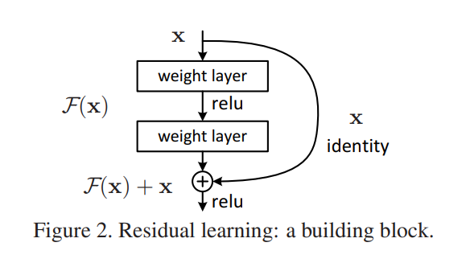
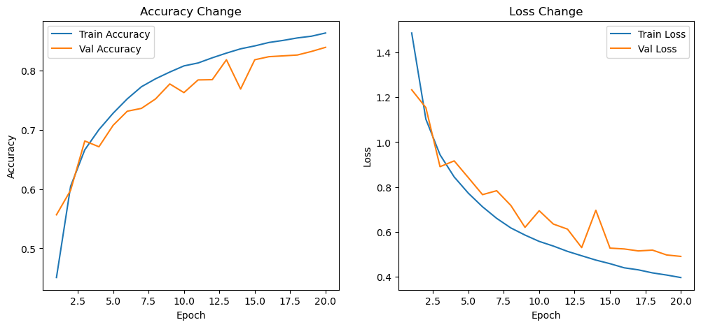

# 📊 Model Training Report


## 🚀 Project Overview

**CIFAR-10 분류를 위한 ResNet**
`PyTorch`를 사용하여 `Residual Network`(`ResNet`) 아키텍처를 구현한 것으로, `CIFAR-10` 이미지 분류 작업에 특화. ResNet의 `Skip connection`은 기울기 소실 문제를 완화하여 매우 깊은 신경망의 효과적인 학습을 가능하게 하며, 다양한 컴퓨터 비전 벤치마크에서 뛰어난 성능을 발휘.

## 📋 Training Details

- **Framework**: PyTorch
- **Optimizer**: Adam
- **Loss Function**: CrossEntropyLoss
- **Learning Rate**: 0.001
- **Epochs**: 20
- **Batch Size (Training)**: 64
- **Batch Size (Validation & Evaluation)**: 100
- **Metrics**: Accuracy, Loss
- **Data Split**: Training and validation sets


## 🔍 Feature

- **깊은 Residual Network**: 사용자 정의 가능한 깊이를 가진 `ResNet` 구현
- **데이터 증강**: 모델의 일반화 성능을 향상시키기 위한 일반적인 데이터 증강 기법 활용
- **학습 및 평가 스크립트**: 모델 학습, 검증, 테스트를 위한 포괄적인 스크립트 제공
- **시각화 도구**: 학습 진행 상황과 모델 성능을 시각화하는 도구
- **모듈화된 코드베이스**: 이해와 확장이 용이한 깔끔하고 모듈화된 코드 구조

## 🔍 Model architecture

모델은 `PyTorch`의 `nn.Module`을 사용하여 구축되었으며, 다음과 같은 구성 요소로 이루어져 있습니다:

- **초기 Convolutional Layer**: 3x3 Convolution으로 입력 이미지를 처리
- **Residual Blocks**: Skip connection을 통한 Residual Blocks의 다중 쌓기
- **Adaptive Average Pooling**: Fully Connected Layer 전에 공간적 차원을 축소
- **Fully Connected Layer**: CIFAR-10 데이터셋의 클래스 확률을 출력

### Residual Block

각 Residual Block은 다음과 같은 구성 요소로 이루어져 있습니다:

1. **Convolutional Layer**: `Batch Normalization`과 `ReLU` 활성화 함수를 포함한 3x3 Convolution
2. **두 번째 Convolutional Layer**: `Batch Normalization`을 포함한 또 다른 3x3 Convolution
3. **Skip Connection**: 입력을 두 번째 Convolutional Layer의 출력에 더함
4. **최종 ReLU 활성화 함수**: 결합된 출력에 `ReLU` 활성화 적용


*Residual Block*

## 🔍 Install

📂 Repository Structure

```bash
├── data/              # Dataset
├── outputs/           # Training logs and visualizations
├── train.py           # Training script
├── requirements.txt   # Dependencies
└── README.md          # Project 
```

### Requirements

- `Python 3.8` 이상
- `PyTorch 1.8.1` 이상
- 기타 라이브러리는 `requirements.txt` 참고

```bash
pip install -r requirements.txt
```

### Repository Clone

```bash
git clone https://github.com/yourusername/resnet-cifar10.git
```

## 📈 Result

### Training Metrics

| Epoch | Train Loss | Train Accuracy | Validation Loss | Validation Accuracy |
|-------|------------|----------------|-----------------|---------------------|
| 1     | 1.4865     | 45.08%         | 1.2336          | 55.66%              |
| 2     | 1.1026     | 60.48%         | 1.1540          | 59.80%              |
| 3     | 0.9440     | 66.63%         | 0.8909          | 68.12%              |
| 4     | 0.8450     | 70.04%         | 0.9167          | 67.14%              |
| 5     | 0.7727     | 72.80%         | 0.8419          | 70.76%              |
| 6     | 0.7122     | 75.22%         | 0.7663          | 73.14%              |
| 7     | 0.6606     | 77.27%         | 0.7838          | 73.62%              |
| 8     | 0.6179     | 78.62%         | 0.7182          | 75.22%              |
| 9     | 0.5861     | 79.75%         | 0.6205          | 77.74%              |
| 10    | 0.5580     | 80.79%         | 0.6947          | 76.28%              |
| 11    | 0.5372     | 81.28%         | 0.6353          | 78.42%              |
| 12    | 0.5135     | 82.15%         | 0.6126          | 78.46%              |
| 13    | 0.4940     | 82.94%         | 0.5304          | 81.82%              |
| 14    | 0.4748     | 83.67%         | 0.6967          | 76.88%              |
| 15    | 0.4587     | 84.16%         | 0.5281          | 81.82%              |
| 16    | 0.4403     | 84.74%         | 0.5243          | 82.34%              |
| 17    | 0.4313     | 85.08%         | 0.5156          | 82.48%              |
| 18    | 0.4177     | 85.50%         | 0.5191          | 82.62%              |
| 19    | 0.4081     | 85.80%         | 0.4975          | 83.22%              |
| 20    | 0.3969     | 86.34%         | 0.4911          | 83.92%              |



*Training VS Validation*

### Accuracy and Loss Trends
**Training Accuracy**:	지속적인 향상을 보이며 최종 에포크에서 86.34%에 도달	86.34%
**Validation Accuracy**:	유사한 추세를 보이며 83.92%로 안정화, 좋은 일반화 성능을 나타냄	83.

**Training Loss**:	지속적인 감소를 보이며 최종 에포크에서 0.3969에 도달	0.3969
**Validation Loss**:	유사한 감소 추세를 보이며 0.4911로 마무리, 효과적인 학습을 나타냄	0.4911

**성능 향상**:	Training Accuracy가 45.08%에서 86.34%로 증가, Validation Accuracy가 55.66%에서 83.92%로 향상됨
**일관된 학습 과정**:	모든 에포크에서 손실 감소, 정확도 증가 추세를 보임
**과적합 방지**:	Validation Accuracy가 Training Accuracy와 유사하거나 더 높아 과적합 없음

### Things to improve
**하이퍼파라미터 최적화**:	학습률, 배치 크기, 에포크 수 등을 추가로 조정하여 성능 향상 가능
**데이터 증강(Data Augmentation)**:	데이터 증강 기법 도입으로 모델의 일반화 강화
**더 깊은 모델 탐색**:	현재보다 더 깊거나 복잡한 모델을 실험하여 성능 향상 도모

---

## ResNet-18

|         구성 요소	          | 레이어 수 |
|----------------------------|----------|
|초기 Convolutional Layer     |     1    |
|Residual Layers (총 4개)     |     16   |
|Fully Connected Layer        |     1    |
|총 레이어 수                  |     18   |

## 표준 ResNet 아키텍처 참고
다양한 `ResNet` 버전의 레이어 구성

|ResNet 버전	|레이어1	|레이어2	|레이어3	|레이어4	|총 Residual Block 수|
|------------|---------|---------|--------|---------|-------------------|
|ResNet-18	|     2	|     2	|         2	|     2	|             8         |
|ResNet-34	|     3	|     4	|         6	|     3	|             16        |
|ResNet-50	|     3	|     4	|         6	|     3	|             16        |
|ResNet-101	|     3 |     4	|       23	|     3	|             33        |
|ResNet-152	|     3	|     8	|       36	|     3	|             50        |

참고: ResNet-50 이상은 Bottleneck Block을 사용하여 Residual Block 내에 더 많은 Convolutional Layer를 포함

## Deep Residual Learning for Image Recognition 내용 정리
*저자: Kaiming He, Xiangyu Zhang, Shaoqing Ren, Jian Sun (Microsoft Research)*   
*출판: CVPR 2016*   
**ResNet은 딥러닝의 "깊은 신경망 학습 불가능" 문제를 해결한 대표적인 연구로, 현대 AI 모델에서도 여전히 필수적인 개념**   

1. 연구 배경
- 딥러닝에서 네트워크의 깊이를 증가시키면 일반적으로 성능이 향상됨.
- 하지만, Vanishing Gradient (기울기 소실) & Degradation Problem (성능 저하) 으로 인해 매우 깊은 네트워크는 학습이 제대로 되지 않음.
- 기존의 VGG 같은 CNN 모델들은 16~30층 수준이 한계였음

2. 핵심 아이디어: Residual Learning (잔차 학습)   
🔹 기존 딥러닝의 문제점
- 기존깊은 네트워크는 얕은 네트워크보다 학습이 잘 되지 않는 Degradation Problem 발생.
    -> 단순히 층을 추가하면 성능이 오히려 나빠지는 현상
   
🔹 해결 방법: Residual Learning Framework   
- 네트워크가 직접 함수 H(x) 를 학습하는 대신, 잔차(Residual) 함수 F(x)=H(x)−x 를 학습하도록 유도.
- 이를 통해 기존 입력값 x 에 작은 변화(Residual)만 더하면 되므로 최적화가 쉬워짐.

✅ 수식 표현:  y=F(x)+x   
여기서, F(x) 는 학습해야 할 잔차 함수, x 는 입력값. 즉, 모델이 직접 H(x) 를 찾는 대신, F(x) 만 찾고 기존 입력 x 에 더하는 방식.

3. ResNet 구조
- Shortcut Connection (지름길 연결, Skip Connection) 을 도입하여 이전 층의 출력을 직접 다음 층으로 전달.
- 이러한 구조는 추가적인 학습 파라미터 없이 정보 흐름을 원활하게 유지함.
- 각 블록은 기본적으로 두 개의 3×3 Conv 레이어로 구성됨.
- 50층 이상에서는 Bottleneck 구조 (1×1, 3×3, 1×1 Conv 사용) 를 도입하여 연산량을 최적화.

4. 실험 결과

🔹 ImageNet 데이터셋 (ILSVRC 2015)   
- 152-layer ResNet: VGG-16보다 훨씬 깊지만, 연산량은 오히려 적고 성능은 뛰어남.
- Ensemble 모델이 Top-5 오류율 3.57% 로 대회 1위 기록! 🚀

🔹 CIFAR-10 실험   
- 20층, 32층, 44층, 56층, 110층 비교 → 깊을수록 성능 향상 (단, 1202층은 오버피팅).  
- 기존 Highway Network(7.54%)보다 110-layer ResNet이 더 낮은 오류율 (6.43%) 기록.  

🔹 Object Detection (PASCAL VOC, MS COCO)  
Faster R-CNN 백본을 ResNet으로 바꿨더니 성능이 크게 향상됨 (COCO 기준 28% 개선).

5. 결론
- ResNet은 잔차 학습(Residual Learning) 을 활용해 딥러닝 네트워크를 매우 깊게 만들면서도 학습이 가능하게 만든 혁신적인 모델.
- 기존 CNN보다 훨씬 깊은 네트워크에서도 성능이 향상됨.
- ResNet 이후, Transformer, Diffusion Models 등 다양한 딥러닝 모델에서 Residual Connection이 필수 개념으로 자리 잡음.

6. 논문의 기여 & 영향
✅ 잔차 학습(Residual Learning) 도입 → 딥러닝 모델의 깊이 한계를 극복 
✅ 152층 이상의 초딥 신경망 학습 가능 → ImageNet 대회 우승 (2015) 
✅ 이후 Transformer, ViT, Diffusion, AlphaFold 등 다양한 분야에서 Residual Connection 필수 요소로 활용 